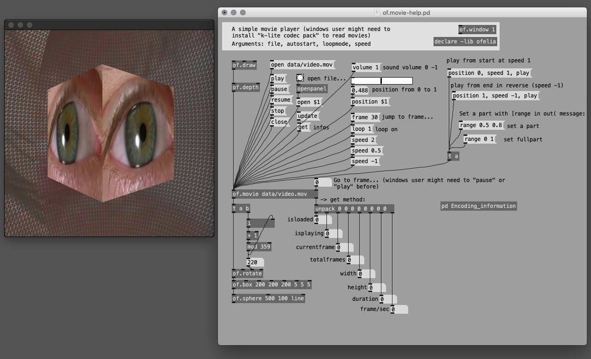

## Fast prototyping abstractions for digital workshop in fine art schools.

Modular primitives abstractions inspired by [GEM](https://puredata.info/downloads/gem), with useful methods, arguments and help files.

Requires [Ofelia](https://github.com/cuinjune/Ofelia) V4.0.0 library to work (help->Find externals).

Many thanks to Zack Lee for making this great PureData library.

Note: windows users might need to install codec package like [k-lite](https://codecguide.com/) in order to be able to play videos.

